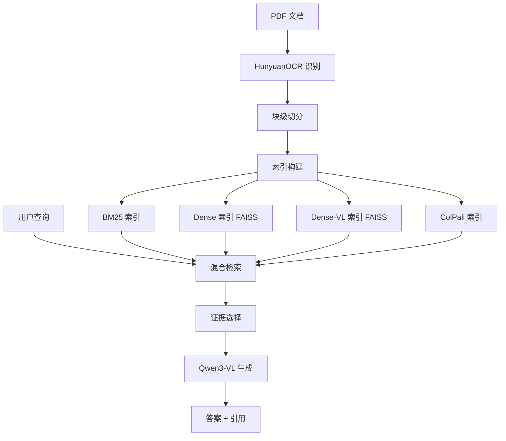

# Doc RAG Evidence

> 🚀 **多模态文档检索增强生成系统** - 支持视觉理解与精确引用的智能问答平台

[](LICENSE)
[](https://www.python.org/)
[](https://gradio.app/)

**当前版本**：V1.2 (2026-01) | [版本详情](VERSION.md)

---

## 📖 简介

Doc RAG Evidence 是一款基于检索增强生成（RAG）技术的企业级文档问答系统，利用 Qwen3-VL 多模态大模型，实现对 PDF 文档的智能理解和精确引用。

### ✨ 核心亮点

- 🎨 **多模态理解**：同时处理文本和图像，理解图表、表格、公式
- 🔍 **四种检索模式**：BM25 + Dense + Dense-VL + ColPali 多模态检索
- 🔗 **精确引用**：每条答案自动标注证据来源 [1][2]...
- 🎛️ **灵活配置**：Hybrid 融合检索，支持自定义权重
- 📦 **批量处理**：支持 1000+ 文档批量上传，实时进度追踪
- ⚡ **性能优化**：Flash Attention 2 + 图像压缩 + 并行索引 = 8-12x 加速
- 🖥️ **Web 界面**：无代码操作，开箱即用

### 🎯 适用场景

| 场景 | 描述 |
|-----|------|
| 📚 **企业知识库** | 技术文档、标准规范、内部资料快速查询 |
| 📑 **合同审查** | 法律条款检索、风险点识别 |
| 🔬 **学术研究** | 论文阅读、文献调研、引用追踪 |
| 📊 **财报分析** | 图表理解、数据提取、趋势分析 |
| 🛠️ **技术手册** | 产品说明、操作指南、故障排查 |

---

## 🏗️ 系统架构



### 技术栈

| 层级 | 组件 | 技术 |
|-----|-----|------|
| **前端** | Web UI | Gradio 6.2.0 |
| **检索** | 关键词 | BM25 (Rank-BM25) |
| | 语义 | Qwen3-Embedding-0.6B + FAISS |
| | 多模态 | Qwen3-VL-Embedding-2B + FAISS |
| | 视觉 | ColPali (ColQwen3-Embed-4B) |
| **生成** | MLLM | Qwen3-VL-4B-Instruct (vLLM) |
| **OCR** | 识别 | HunyuanOCR (vLLM) |
| **存储** | 文档 | Local FS (JSON) |
| | 索引 | FAISS + BM25 Index |
| **加速** | 推理 | Flash Attention 2 |

### GPU 资源分配

```
  GPU0: HunyuanOCR          (Port 8000) │  ← 文档 OCR 识别
  GPU1: Qwen3-Embedding     (Port 8001) │  ← 语义向量编码
  GPU2: ColPali / Dense-VL  (延迟加载)  │  ← 视觉/多模态检索（可共享）
  GPU3: Qwen3-VL-4B         (Port 8002) │  ← 答案生成
```

**GPU2 共享机制**：
- ColPali 和 Dense-VL 都支持图像 resize (max_image_size: 1024)
- 显存优化后可在同一张 GPU 上运行（互斥延迟加载）
- 适合单 GPU 资源有限场景

---

## 🚀 快速开始

### 环境准备

**硬件要求**：
- 4x NVIDIA GPU（每张 ≥8GB 显存）
- 128GB 内存
- 500GB 存储空间

**软件要求**：
- Linux (Ubuntu 20.04+)
- Python 3.9+
- CUDA 11.8+

### 一键启动

```bash
# 1. 启动所有后台服务（OCR + Embedding + Generation）
bash scripts/start_services.sh

# 等待服务就绪（约 30-60 秒）

# 2. 启动 Web UI
bash scripts/start_ui.sh

# 3. 访问界面
# 浏览器打开: http://localhost:7860
```

### 基本使用

#### 1️⃣ 上传文档

```
📤 "Document Management" 标签
 点击 "Upload PDF Files"（支持多选）
 勾选 "Use OCR"（扫描版必选）
 点击 "Ingest Documents"
 
💡 大批量上传提示：
 • 支持 1000+ 文件批量上传
 • 自动分批处理（50个/批）避免内存溢出
 • 实时进度追踪，每10个文件显示ETA
 • 失败文件不影响其他文件处理
```

#### 2️⃣ 构建索引

```
🔨 "Build Indices" 区域
 选择索引类型（单选，避免GPU OOM）：
   ○ bm25        - 关键词索引（快速，推荐）
   ○ dense       - 语义向量索引（理解能力强）
   ○ dense_vl    - 多模态索引（文本+图像理解）⭐ 新增
   ○ colpali     - 视觉索引（图表理解）
 
 输入索引名称后缀（可选，默认 "default"）
 点击 "Build Index"
 
⚡ Dense-VL 性能优化：
 • Flash Attention 2：~2x 加速
 • 图像压缩 (1024px)：~2x 加速
 • 4 worker 并行：~4x 加速
 • 总计：8-12x 实际加速
```

#### 3️⃣ 开始提问

```
💬 "Query & Answer" 标签
 输入问题（如："碳酸氢钠的用途是什么？"）
 选择检索模式：
   • bm25      - 关键词精确匹配
   • dense     - 语义理解（同义词）
   • dense_vl  - 多模态理解（文本+图像）⭐ 新增
   • colpali   - 视觉理解（图表、表格）
   • hybrid    - 混合检索（推荐）
 
 选择证据格式：
   • text  - 文本片段（精确引用）
   • image - 页面图片（适合图表）
 
 Hybrid 模式配置：
   • 选择2个检索器（如 dense_vl + bm25）
   • 调节权重（如 0.6 : 0.4）
   • 选择融合方法（RRF 推荐）
 
 点击 "Ask Question"
```

#### 4️⃣ 查看结果

- **检索结果**：候选文档列表（doc_id, page, score）
- **证据**：选中的段落/页面（带来源标注）
- **答案**：生成的回答 + 引用标记 [1][2]...

---

## 💡 核心功能

### 1. 多模态检索（V1.2 新增）

**Dense-VL (Qwen3-VL-Embedding-2B)**：
- **能力**：同时理解文本和图像内容
- **优势**：对图表、表格、公式有更好的理解
- **性能**：页面级索引，4096维向量
- **架构**：离线索引 + 懒加载（类似ColPali）

**性能优化三板斧**：

| 优化项 | 技术 | 加速比 | 说明 |
|-------|------|--------|------|
| **Flash Attention 2** | 优化注意力计算 | ~2x | 自动检测，无则降级 |
| **图像压缩** | 长边压缩至1024px | ~2x | 可配置 1024/2048/原图 |
| **并行索引** | 多worker GPU共享 | ~4x | 默认4 worker (24GB GPU) |
| **总计** | - | **8-12x** | 实测56页：140s → 15s |

**配置示例** (configs/app.yaml):
```yaml
# ColPali 配置（视觉检索）
colpali:
  enabled: true
  model: "/workspace/cache/tomoro-colqwen3-embed-4b"
  device: "cuda:2"
  batch_size: 8
  max_global_pool: 100
  max_image_size: 1024      # 图像 resize，节省显存

# Dense-VL 配置（多模态检索）
dense_vl:
  enabled: true
  model_path: "/workspace/cache/Qwen3-VL-Embedding-2B"
  gpu: 2                    # 与 ColPali 共享 GPU2
  max_image_size: 1024      # 图像压缩大小
  num_workers: 4            # 并行 worker 数量
  batch_size: 8             # 每批处理数量
```

**显存优化**：
- `max_image_size: 1024` - 图像最长边压缩至 1024px
- `max_image_size: 2048` - 高质量模式（需更多显存）
- `max_image_size: null` - 使用原始大小（不推荐）
- 优化后 ColPali + Dense-VL 可共享一张 24GB GPU

### 2. 多模态生成

| 模式 | 输入 | 优势 | 适用场景 |
|-----|------|------|---------|
| **text** | OCR 文本片段 | 精确引用段落，token 消耗少 | 纯文本文档、合同、论文 |
| **image** | 页面图片 | 理解图表、表格、公式、布局 | 技术手册、财报、研究报告 |

**生成引擎**：Qwen3-VL-4B-Instruct
- 参数规模：4B
- 能力：多模态理解、引用控制、幻觉抑制
- 部署：vLLM 高性能推理

### 3. 混合检索（Hybrid Retrieval）

**可选组合（新增 Dense-VL）**：
- `BM25 + Dense`：关键词 + 语义（通用推荐）
- `BM25 + Dense-VL`：关键词 + 多模态（图表文档推荐）⭐
- `Dense-VL + ColPali`：多模态双塔（深度理解）⭐
- `Dense + ColPali`：语义 + 视觉（探索性查询）

**融合策略**：
1. **weighted_sum**（加权求和）
   ```python
   final_score = w1 * score1 + w2 * score2
   ```
   - 适合：分数尺度一致的检索器
   - 参数：调节 w1, w2 (和为 1.0)

2. **rrf**（倒数排名融合，推荐）
   ```python
   final_score = w1/(k + rank1) + w2/(k + rank2)
   ```
   - k=60（常数，来自RRF论文）
   - w1, w2 为权重（和为 1.0）
   - 适合：跨模态融合（如 BM25 + Dense-VL）
   - 优势：对分数尺度不敏感，基于排名而非原始分数

**权重调节**：
- UI 滑块实时调整（0.0 - 1.0）
- 动态显示权重分配
- 支持快速 A/B 测试
- **注意**：两种融合策略都支持权重调节

### 4. 批量处理优化（V1.2）

**智能分批上传**：
- 自动检测大批量（>100 文件）
- 分批处理：50 文件/批
- 批次间垃圾回收，避免内存溢出
- 实时进度：每10个文件更新一次

**进度追踪**：
```
[450/1416] Processing: document_450.pdf
  ✅ Success: doc_450 (12 pages)

📊 Progress: 450/1416 (31%)
   Elapsed: 3600s | ETA: 7740s

[Batch 9/29] Files 401-450 of 1416
```

**容错机制**：
- 单文件失败不影响其他文件
- 详细错误日志
- 最终汇总报告：成功数/失败数/总数

**增量索引**：
- 新文档自动加入已有索引
- 无需重建全部索引
- 节省时间和计算资源

**批量评估**：
- 支持 CSV/JSON 数据集
- 自动运行问答
- 导出评估报告（predictions + metrics）
- 支持所有检索模式（含 Dense-VL）

### 5. 文档处理

**高精度 OCR**：
- 引擎：HunyuanOCR（腾讯混元）
- 支持：中英文、表格、公式、手写体
- 输出：结构化文本 + 布局信息

**块级切分**：
- 粒度：page → blocks
- 策略：保留语义完整性
- 存储：text.json + blocks.json + page.png

---

## 📂 项目结构

```
doc-rag-evidence/
 app/ui/                 # Gradio Web UI
   └── main_v1.py          # 主界面
 core/                   # 核心抽象层
   ├── schemas.py          # 数据模型（Pydantic）
   └── pipeline.py         # RAG 处理流程
 impl/                   # 功能实现层
   ├── ingest_pdf_v1.py    # PDF 摄取 + OCR
   ├── index_bm25.py       # BM25 索引器
   ├── index_dense.py      # Dense 索引器（FAISS）
   ├── index_dense_vl.py   # Dense-VL 多模态索引器 ⭐
   ├── index_colpali.py    # ColPali 索引器
   ├── retriever_hybrid.py # 混合检索器
   ├── generator_qwen_vl.py # 多模态生成器
   ├── selector_topk.py    # 证据选择器
   └── eval_runner.py      # 评估运行器
 infra/                  # 基础设施层
   ├── store_local.py      # 文档存储
   └── runlog_local.py     # 运行日志
 scripts/                # 运维脚本
   ├── start_services.sh   # 一键启动
   ├── start_ui.sh         # 启动 UI
   ├── build_dense_vl_index.py # Dense-VL 离线索引构建 ⭐
   └── stop_all_vllm.sh    # 停止服务
 configs/
   └── app.yaml            # 配置文件
 data/                   # 数据目录
    ├── docs/               # 文档工件
    ├── indices/            # 索引文件
    ├── runs/               # 查询日志
    └── reports/            # 评估报告
```

---

## ⚙️ 配置

### 核心参数（configs/app.yaml）

```yaml
# 检索配置
chunk_level: block          # page | block
top_k_retrieve: 20          # 检索召回数
top_k_evidence: 5           # 最终证据数

# 生成配置
generator:
  type: qwen3_vl            # qwen3_vl (MLLM) | qwen3_llm | template
  
llm:
  backend: vllm
  model: "Qwen/Qwen3-VL-4B-Instruct"
  endpoint: "http://localhost:8002"
  max_new_tokens: 1024
  temperature: 0.1          # 0.0-1.0，越低越确定
  citation_policy: strict   # 强制引用证据
```

### 服务端口

| 服务 | 端口 | GPU | 用途 |
|-----|------|-----|------|
| OCR | 8000 | 0 | 文档识别 |
| Embedding | 8001 | 1 | 向量编码 (Dense) |
| Generation | 8002 | 3 | 答案生成 |
| Dense-VL | - | 2 | 多模态检索（延迟加载）⭐ |
| ColPali | - | 2 | 视觉检索（延迟加载，可与 Dense-VL 共享）|
| UI | 7860 | - | Web 界面 |

---

## 📊 功能清单

### ✅ 已实现

| 功能 | 状态 | 说明 |
|-----|:----:|------|
| PDF 文档摄取 | ✅ | 批量上传 + OCR 识别 + 智能分批 |
| 索引构建 | ✅ | BM25/Dense/Dense-VL/ColPali 增量更新 |
| Dense-VL 多模态检索 | ✅ | Qwen3-VL-Embedding-2B + 性能优化 |
| 单一检索 | ✅ | 四种模式独立运行 |
| 混合检索 | ✅ | 任意组合 + 权重调节 + Dense-VL 支持 |
| 文本生成 | ✅ | 基于 OCR 文本片段 |
| 图像生成 | ✅ | 基于页面图片（多模态）|
| Web UI | ✅ | 流式进度反馈 + 大批量优化 |
| 批量评估 | ✅ | CSV/JSON 数据集 + 全模式支持 |
| Flash Attention 2 | ✅ | ColPali + Dense-VL 自动加速 |
| 图像 Resize | ✅ | ColPali + Dense-VL 显存优化 |

### 🔄 进行中（V1.3）

| 任务 | 进展 | 优先级 |
|-----|------|:------:|
| Dense-VL API 模式 | 🟡 规划中 | P1 |
| 多轮对话支持 | 🟡 设计中 | P1 |
| Reranker 集成 | 🟢 待开发 | P2 |

---

## 📚 文档

- � [版本说明](VERSION.md) - 版本历史和开发路线图

---

## 🗺️ 路线图

### V1.2 - Dense-VL 多模态检索 + 显存优化（已完成 ✅）

- [x] **Dense-VL 集成** - Qwen3-VL-Embedding-2B 多模态索引
- [x] **性能优化** - Flash Attention 2 + 图像压缩 + 并行索引
- [x] **显存优化** - ColPali + Dense-VL 图像 resize，支持 GPU 共享
- [x] **UI 增强** - 流式进度 + 大批量上传优化
- [x] **Hybrid 扩展** - 支持 Dense-VL 混合检索
- [x] **Hit Normalization** - 页面→块级自动扩展

### V1.3 - 体验优化（进行中）

- [ ] **Dense-VL API 模式** - vLLM/SGLang 在线服务
- [ ] **多轮对话** - 上下文记忆与引用追踪
- [ ] **Reranker** - 二阶段精排
- [ ] **缓存优化** - 向量/结果缓存加速

### V1.4 - 评估增强（规划中）

- [ ] **三层评估** - 检索/证据/生成分层指标
- [ ] **对比实验** - A/B 测试框架
- [ ] **可视化分析** - 性能仪表盘

---

## 🤝 贡献

 Issue 和 Pull Request！

## 📄 许可证

 MIT 许可证 - 详见 [LICENSE](LICENSE) 文件

---

<div align="center">

**最后更新**：2026-01-18  
**当前版本**：V1.2 - Dense-VL 多模态检索 + 显存优化

[🏠 首页](README.md) • [📜 版本说明](VERSION.md) • [🐛 报告问题](https://github.com/your-org/doc-rag-evidence/issues)

</div>
